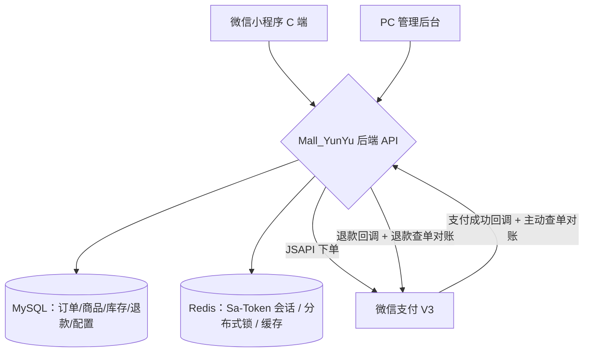

# 商用级生鲜商城全栈开源：SpringBoot3 + 微信支付V3 + uni-app，真实收款已跑通（附防超卖与支付幂等实战）

> 一个**已真正商用、能真实收款到账** 的 B2C 生鲜电商小程序，前端 uni-app（微信小程序）、PC 端 Vue3 管理后台、后端 SpringBoot3 单体，前后端分离，交易闭环完整：浏览 → 加购 → 下单 → 微信 JSAPI 支付 → 发货 → 收货 → 售后（支持单件部分退款），一套代码全栈开源。


---

## 一、先看能力：功能模块

整个项目按「三端 × 四域」组织，开箱即用的模块非常完整：

```
生鲜商城小程序（全栈开源）
├── C 端小程序（uni_free_mall）
│   首页 分类 搜索 商品详情 购物车 确认订单 微信支付 订单列表/详情 售后退款
│   地址管理 我的收藏 我的(登录/隐私协议) 今日推荐 运营大屏数据
├── PC 管理后台（soybean-admin / Naive UI）
│   登录 总览看板(19项只读指标) 商品(SPU/SKU) 库存 分类 订单 售后
│   Banner 公告 服务项 店铺配置 系统配置(支付密钥加密入库) 用户 文件上传
└── 后端 API（Mall_YunYu / SpringBoot3 单体）
    登录 Sa-Token 订单 支付(JSAPI+回调+对账) 退款(部分/全额+对账) 库存 推荐 配置热更新
```

个人主体也能跑通体验：后端内置**模拟支付开关**（`pay_demo_enabled=1`），无需真实商户号即可演示"下单 → 支付 → 回调"全流程；正式商用则注入真实商户参数，**每一分钱都真实进入你的微信商户号**。

> 业务边界说明：生鲜类目"不退货物、运费免费、线下配送"，因此明确不做优惠券/满减/秒杀/拼团/会员积分/退货退款等，专注把"下单 → 收款 → 对账 → 部分退款"这一条最核心的商业链路做扎实。

---

## 二、技术架构与选型（含"为什么不做微服务"的思考）

为了给读者"怎么选技术"的参考，这里把关键选型理由都列出来：

| 层 | 选型 | 为什么 |
|----|------|--------|
| 语言 / 框架 | Java 21 + SpringBoot 3.3 | 虚拟线程提升 I/O 并发；Boot3 为时代主流 |
| ORM | MyBatis-Plus 3.5 | 手写 SQL 更可控，防超卖这类原子操作必须手写 |
| 认证 | Sa-Token | 轻量、内置 Redis 会话，个人项目够用且简单 |
| 缓存 / 分布式锁 | Redis + Redisson | 支付回调幂等、并发扣库存的"重武器" |
| 数据库 | MySQL 8 | 金额一律 `DECIMAL(10,2)` + `BigDecimal`，杜绝浮点误差 |
| 支付 | WxJava 4.6（微信支付 V3） | Java 生态最成熟的微信支付封装 |
| 前端后台 | Vue3 + Vite + Naive UI | 兼顾开发效率与颜值（后台实际用的 Naive UI） |
| 小程序 | uni-app（Vue3 + TS + Pinia） | 一套代码可发多端，语法贴近 Vue 生态 |



**为什么是单体、不是微服务？** 项目就一套后端一个业务域，微服务的服务拆分 / 网关路由 / Nacos 注册 / 配置中心在这规模下**只会带来运维复杂度而没有收益**。因此这里刻意**不引入网关、不用 Nacos**，把分布式难点（并发扣库存、支付幂等）下沉到业务层用 Redis + Redisson 解决。这是"不加复杂度、够用即最优"的务实选择，也是单机可部署、上手成本低的关键。

---

## 三、核心难点与解决方案（真正的干货）

### 3.1 防超卖：数据库原子扣减 + 乐观锁

商品一对多 SKU，实时库存独立成 `goods_inventory` 表，并配套 `inventory_log` 变动流水。**扣库存与创建订单在同一个事务**，扣减失败整体回滚（取消订单 / 退款再按 item `rollback()` 加回）。

```sql
UPDATE goods_inventory
   SET stock = stock - #{num}, version = version + 1
 WHERE goods_id = #{goodsId} AND sku_id = #{skuId}
   AND stock >= #{num} AND version = #{version};
-- 影响行数 = 0 即判定并发超卖 / 版本冲突，业务层回滚并抛出"库存不足"
```

要点：

- 条件 `stock >= num` 让数据库在**原子层面拦截超卖**，比"先查后扣"的竞态安全得多；
- `version` 乐观锁用于**防止同一库存被并发读改写**（防止"读旧值→覆盖新值"式的丢失更新）；
- 所有库存变动写 `inventory_log`，后台有独立的"库存管理"页可对账。

### 3.2 支付闭环：三道防线，彻底告别"丢单 / 重复回调 / 金额被改"

作为商用项目，支付环节不能只靠"回调成功就改状态"。本项目做了**三道防线**：

1. **回调验签 + 金额一致性校验**：所有微信回调先验签，再把微信返回的 `cash_fee` 与本地订单实付 `pay_price` 强比较，只认"金额完全一致"的回调。
2. **幂等三重保障**：回调处理"数据库唯一键 + 订单状态位 + Redisson 分布式锁"三管齐下，同一个回调被微信重复投递也不会二次置状态 / 二次退款。
3. **对账补偿（兜底）**：不能只靠被动等回调。定时任务**每 3 分钟**主动调 `订单查询`、**每 5 分钟**调 `退款查询接口`，把"回调丢了 / 卡在处理中"的订单主动拉回来。

```java
// 幂等三件套示意
// 1) pay_callback_log 唯一键拦截重复投递
// 2) 订单状态位：只有"待支付→已支付"才允许流转
// 3) Redisson lock("pay:" + orderNo) 串行化同一订单的处理
```

### 3.3 金额一致性：全程 `BigDecimal`，绝不用浮点

金额在 MySQL 存 `DECIMAL(10,2)`，Java 侧一律 `BigDecimal` 参与运算，前后端交互用 `分` 或两位小数字符串，避免 `0.1+0.2` 这类浮点误差串进对账逻辑。退款金额再叠加一层校验：`0 < 退款额 ≤ 订单剩余可退`，从流程上堵死"超退 / 无限退"。

### 3.4 订单状态机：只正向流转、强制留痕

```
待付款(0) → 待发货(1) → 待收货(2) → 已完成(3)
             ↑30分钟未支付自动取消(9)
```

状态变更统一走 `updateStatus(id, fromStatus, toStatus)` 乐观锁，**影响行数=0 即冲突**；每次流转强制写 `order_status_log`（谁操作、原状态、新状态）。后台故意**不提供"取消订单 / 直接退款"按钮**，从源头防止人工资损。

### 3.5 假配送（生鲜业务特色）

C 端不接第三方骑手，支付成功后展示"配送中"界面，商家线下配送 + 电话确认后，后台点【配送完成】。这是"真实收款 + 轻量线下履约"的务实设计，把第三方配送对接的成本省掉了。

---

## 四、项目界面效果图

小程序 C 端主要界面（更多页面原型见仓库 `小程序第一套UI展示图/`，均为各页面的设计稿）：


---

## 五、怎么把它跑起来 / 部署上线

1. **初始化数据库**：导入 `12_运维部署/全量数据库fresh_mall.sql`（含建表 + 商品 / 分类 / 轮播等演示数据）。
2. **后端**：`mvn clean package` → `java -jar target/Mall_YunYu-0.0.1-SNAPSHOT.jar --spring.profiles.active=prod`，密钥全部走环境变量注入（绝不写入提交文件）。
3. **PC 后台**：`pnpm install && pnpm build`，静态 `dist/` 交给 Nginx，`/api` 反向代理到后端 8080。
4. **小程序**：HBuilderX 打开 `uni_free_mall` → 编辑 `.env.production` 的 `VITE_API_BASE_URL` → 发行"小程序-微信" → 微信开发者工具导入上传。
5. **开启真实收款**：向客户收集 6 项资料——小程序 AppID / AppSecret / 微信商户号 / APIv3 密钥 / 证书序列号 / `apiclient_key.pem` + `apiclient_cert.pem`，填入后台"系统配置"。**证书私钥严禁放入仓库 / 上传目录**。

> 完整部署手册见仓库 `12_运维部署/运维部署技术文档.md`，涵盖 Nginx 反向代理、systemd 守护、备份回滚、排障表。

---

## 六、踩坑经验（真实上线教训，建议收藏）

1. **已取消的订单收到支付成功回调**：回调必须再校验取消态，命中后自动 `markPaidAndAutoRefund()` 原路退回，否则一头一尾钱单错乱。
2. **回调被重复投递导致重复置状态 / 重复退款**：唯一键 + 状态位 + 分布式锁三重幂等，只靠"判断一下"防不住。
3. **订单 / 退款永久卡在中间态**：只依赖被动回调必踩坑，必须加 3/5 分钟的主动查单对账兜底。
4. **金额被改 / 超退**：回调强校验 `cash_fee == 订单实付`，退款再校验 `0 < 额 ≤ 剩余可退`。
5. **并发扣库存超卖**：用 `stock >= num AND version` 的原子 UPDATE，而不是"查→改"。
6. **退款"处理中"状态缺失**：不能直接落终态，要在退款单维护中间态，由回调 / 查单驱动进入终态。
7. **订单号 / 退款号高并发碰撞**：前缀 + 14位时间戳 + 4位自增 + 3位随机，再做库唯一索引兜底。
8. **生产环境图片被重新发版丢光**：上传目录必须挂持久化卷 / 对象存储。

---

## 七、开源与结语

- 源码仓库（Gitee）：**https://gitee.com/yunyustudio/YunYuFresh_mall**（`YunYuFresh_mall`，内含三端完整源码 + `README` 在线演示入口 + `12_运维部署/` 建表与部署手册）。
- 项目协议：**MIT** 开源，免费商用，仅要求保留作者署名（Mall_YunYu / 蕴宇）。
- 运行演示视频：全栈开发 + 真实支付演示，见仓库 `README.md` 顶部「在线演示」区块 / `douyin.jpg`。
- 对旧库升级、定制开发、真实收款接入有需要，欢迎在仓库留言（Issue）联系。

**项目把"真实收款、只想做生鲜这最难一条链"这一条商业主线做得很扎实**：从原子防超卖、支付幂等、对账补偿到部分退款、配置热更新，都是可以直接上生产验证过的实打实经验。如果你是学生做毕设、或想低成本拥有一个"能真收钱"的商城，这套代码值得克隆一份跑一跑。

> 建议发布标签：`毕业设计` `微信支付` `微信小程序` `Spring Boot` `uni-app` `生鲜电商` `Vue3` `全栈` `Java`。