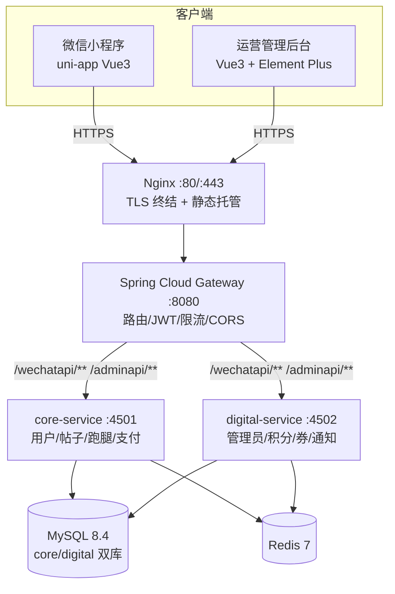
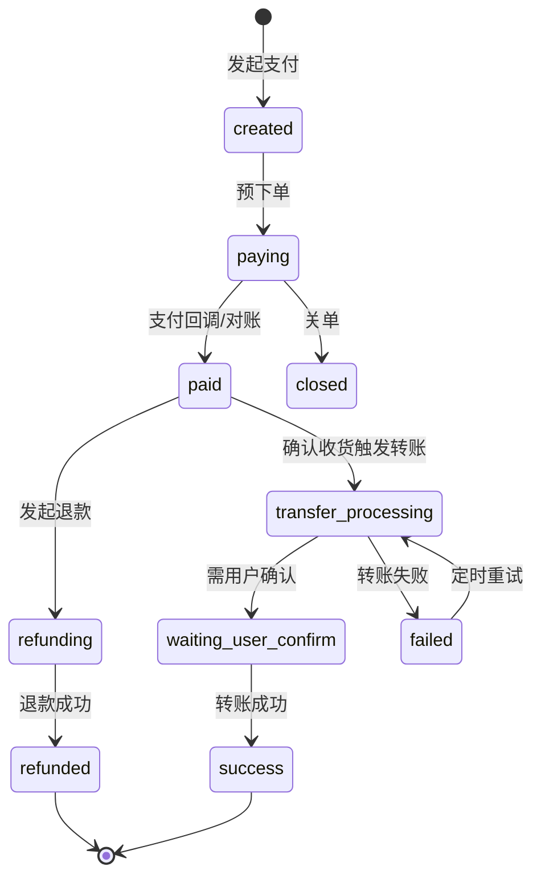

# Java 21 + Spring Boot 3.5 全栈实战：校园社区 + 跑腿撮合微服务架构与支付链路踩坑全记录

> 本文复盘一套面向高校场景的 **UGC 社区 + 校园跑腿（C2C 撮合）** 全栈项目，重点拆解三进程轻量微服务架构、微信支付 V3 真实资金链路（支付 / 退款 / 商家转账）的设计与落地，并完整记录支付状态机、幂等防护、并发抢单、转账失败处理等实战踩坑。技术栈：Java 21 · Spring Boot 3.5.16 · Spring Cloud Gateway 2025.0.3 · MySQL 8.4 · Redis 7 · uni-app（Vue 3）。

> 开源地址（非生产使用免费，商用须授权）：  
> GitHub：https://github.com/YunYustudio/YunYuJXForumUniversity  
> Gitee：https://gitee.com/yunyustudio/YunYuJXForumUniversity

---

## 一、项目背景与定位

校园场景天然存在两个高频需求：**内容社交（论坛）** 和 **生活互助（跑腿）**。前者解决信息交流与归属感，后者解决"代取快递、代买餐食、代办事"等长尾痛点。把两者合在一个产品里，还能形成"工具带内容、内容带活跃"的交叉引流。

`JX蕴宇高校论坛` 就是这套思路的落地，包含三大组成部分：

| 组成部分 | 说明 |
| --- | --- |
| 用户端小程序 `jxfourm_uniopen` | uni-app（Vue 3）开发，一套代码编译微信小程序 / H5 / App，自绘导航、设计令牌主题、零第三方 UI 库 |
| 微服务后端 `yunyucompus` | Spring Cloud Gateway 网关 + core / digital 双业务服务，三进程轻量微服务 |
| 运营管理后台 `art-design-proVue3AdminPC` | Vue 3 + Vite + Element Plus + Pinia，30+ 运营页面（内容审核、跑腿运营、积分券、RBAC、系统配置） |

商业模式上采用 **单对单独立部署 + 源码出售**，架构设计特别强调 **轻量（单台 4 核 4GB 云服务器可跑）、可交付、安全可审计**，同时完整接入 **微信支付 V3 真实资金链路**。

---

## 二、整体架构设计

### 2.1 为什么是"三进程轻量微服务"而不是标准微服务？

校园级产品的并发量有限，但"交付给客户独立部署"是硬约束——客户不可能去运维一套 Nacos + Sentinel + RocketMQ + K8s。于是做了一个"够用就好"的取舍：



关键决策：

- **不引入 Nacos / Docker / MQ**：网关用静态路由指向固定端口（`127.0.0.1:4501 / :4502`），事件链路用 Redis + 定时任务替代消息队列。单机部署更轻、客户运维成本更低。
- **三进程内存合计约 3.2GB**，适配单台 4 核 4GB 服务器。
- **生产安全**：业务服务仅监听 `127.0.0.1`，外部只可达网关 `:8080`；密钥全部走环境变量注入；Nginx 仅做 TLS 终结。

### 2.2 双库数据边界：写入方唯一

两个业务服务分治两个库，遵循"**写入方唯一，跨进程只读共享库**"原则：

- `YunYu_compus_core`：用户 / 帖子 / 评论 / 跑腿订单 / 支付（20+ 表），由 core-service 主写
- `YunYu_compus_digital`：管理员 / 积分 / 优惠券 / 通知（20+ 表），由 digital-service 主写

跨进程读取对方库是允许的，但绝不在两个服务里写同一张表——这避免了分布式事务的复杂度。

---

## 三、核心实现深度解析

### 3.1 微信支付 V3 真实资金链路

这是整个项目最硬核的部分。资金链路不能出错，所以围绕"**状态机 + 验签 + 幂等 + 对账兜底**"四道防线来设计。

#### 3.1.1 三套独立状态机

支付、退款、转账各自维护独立状态机，互不混淆：

```java
// 支付单状态 payment_order.status
PAY_STATUS_CREATED / PAYING / PAID / CLOSED / REFUNDING / REFUNDED

// 退款单状态 payment_refund.status
REFUND_STATUS_PROCESSING / SUCCESS / CLOSED / ABNORMAL

// 转账单状态 payment_transfer.status
TRANSFER_STATUS_ACCEPTED / PROCESSING / WAIT_USER_CONFIRM / SUCCESS / FAILED / CANCELLED
```

资金链路状态流转：



一个容易踩的坑：`TRANSFER_STATUS_PROCESSING`（支付转账台账状态）和 `ERRAND_STATUS_TRANSFER_PROCESSING`（跑腿订单侧状态）是两类不同的状态。前者是资金台账的真相，后者是业务订单的状态。设计时必须分开，否则会混淆"钱到没到"和"订单完成没完成"。

#### 3.1.2 回调验签：防重放 + RSA-SHA256 + AES-256-GCM

微信支付回调是资金状态推进的主要驱动，必须严格验签。回调端点设计为 **fail-closed**：

```java
@PostMapping("/pay")
public R<Void> onPayNotify(@RequestBody String body,
        @RequestHeader(value = HEADER_SIGNATURE, required = false) String signature,
        @RequestHeader(value = HEADER_SERIAL, required = false) String serial,
        @RequestHeader(value = HEADER_NONCE, required = false) String nonce,
        @RequestHeader(value = HEADER_TIMESTAMP, required = false) String timestamp) {
    Map<String, Object> data = decrypt(body, signature, serial, nonce, timestamp);
    String outTradeNo = str(data, "out_trade_no");
    String transactionId = str(data, "transaction_id");
    paymentService.handlePaySuccess(outTradeNo, transactionId);
    return R.ok();
}
```

验签核心逻辑（`decrypt` 方法）：

```java
private Map<String, Object> decrypt(String body, String signature, String serial,
        String nonce, String timestamp) {
    // 1) 防重放：5分钟时间窗口
    long diff = Math.abs(System.currentTimeMillis() - ts * 1000L);
    if (diff > REPLAY_WINDOW_MILLIS) {
        throw new ResponseStatusException(HttpStatus.UNAUTHORIZED, "回调已过期（防重放）");
    }
    // 2) 官方SDK NotificationParser：验签 + AES-256-GCM解密 + 反序列化 一步完成
    RequestParam requestParam = new RequestParam.Builder()
            .serialNumber(serial).nonce(nonce).signature(signature)
            .timestamp(timestamp).body(body).build();
    NotificationParser parser = wechatPayConfig.getNotificationParser();
    return parser.parse(requestParam, LinkedHashMap.class);
}
```

退款、转账回调复用同一套 `decrypt` 链路，真实模式携带微信真实状态，mock 模式只依赖本地台账——这样本地联调不用真的走微信。

#### 3.1.3 幂等体系：三层防护

资金链路最怕"重复出款"和"重复推进状态"。项目用三层幂等：

**第一层：Idempotency-Key 拦截器（Redis SET NX）**

```java
String clientKey = request.getHeader(CommonConstants.HEADER_IDEMPOTENCY_KEY);
String redisKey = RedisKeys.idem(annotation.biz(),
        (userId == null ? "anon" : userId) + ":" + clientKey);
Boolean acquired = stringRedisTemplate.opsForValue()
        .setIfAbsent(redisKey, "1", Duration.ofSeconds(annotation.ttlSeconds()));
if (Boolean.FALSE.equals(acquired)) {
    throw BizException.of(ResultCode.COMMON_IDEMPOTENT_REPEAT);
}
```

客户端传 `Idempotency-Key` 请求头，服务端 Redis 抢占 5 分钟 TTL。这里有个取舍：**Redis 不可用时 fail-open 放行**，避免缓存故障把主链路卡死——因为后面还有数据库条件更新兜底。

**第二层：状态机条件更新（数据库层兜底）**

```java
int rows = paymentOrderMapper.update(null, Wrappers.<PaymentOrder>lambdaUpdate()
        .eq(PaymentOrder::getId, order.getId())
        .in(PaymentOrder::getStatus,
                PaymentConstants.PAY_STATUS_CREATED, PaymentConstants.PAY_STATUS_PAYING)
        .set(PaymentOrder::getStatus, PaymentConstants.PAY_STATUS_PAID)
        .set(PaymentOrder::getTransactionId, transactionId));
if (rows == 0) {
    return false; // 并发：已被别人推进，幂等返回
}
```

`UPDATE ... WHERE id=? AND status IN (created, paying)` 这种条件更新是资金幂等的最后一道闸门，`rows == 0` 说明状态已变，直接幂等返回，不会重复推进到 `paid`。

**第三层：退款幂等复用 + 转账幂等复用**

退款时先查同业务单是否已有 `processing` 退款单，有就复用：

```java
PaymentRefund existing = stateMachine.findProcessingRefund(command.businessType(),
        command.businessId(), command.refundFen(), command.outTradeNo());
if (existing != null) {
    log.info("[PAY] 退款幂等复用已有 processing 单 outRefundNo={}", existing.getOutRefundNo());
    return existing;
}
```

转账时查同单是否已有"可复用状态"的转账单，避免并发双出款：

```java
PaymentTransfer existing = paymentService.latestTransfer(PaymentConstants.BIZ_ERRAND, order.getId());
if (existing != null && TRANSFER_REUSABLE.contains(existing.getStatus())) {
    return existing;
}
```

#### 3.1.4 定时对账：回调丢失时的兜底真相来源

回调可能丢失、延迟、重复，所以需要一个独立于回调的"真相来源"。`PaymentReconcileSchedule` 每 5 分钟跑一次，用 Redis 分布式锁防多实例并发：

```java
@Scheduled(cron = "0 */5 * * * *")
public void reconcile() {
    if (!paymentClient.realMode()) return;      // mock 模式无需查微信
    if (!tryLock("pay:reconcile")) return;     // 分布式锁
    try {
        reconcilePayments();    // 查单推进/关单
        reconcileTransfers();   // 转账状态对齐
        reconcileRefunds();     // 退款状态对齐
    } catch (Exception e) {
        log.error("[RECONCILE] 对账任务异常", e);
    } finally {
        unlock("pay:reconcile");
    }
}
```

对账的核心思路：**以微信查单结果作为资金真相**，本地非终态的记录按真实结果推进或关单。

---

### 3.2 校园跑腿 C2C 撮合

#### 3.2.1 订单状态机

跑腿订单有 8 个状态，覆盖"发布 → 支付 → 抢单 → 履约 → 确认 → 转账 → 完成 / 取消"全生命周期：

```java
ERRAND_STATUS_PENDING_PAYMENT   // 待支付
ERRAND_STATUS_WAITING_RUNNER    // 待接单
ERRAND_STATUS_ACCEPTED          // 已接单
ERRAND_STATUS_IN_PROGRESS       // 履约中
ERRAND_STATUS_WAITING_CONFIRM   // 待确认收货
ERRAND_STATUS_TRANSFER_PROCESSING // 转账处理中
ERRAND_STATUS_COMPLETED         // 已完成
ERRAND_STATUS_CANCELLED         // 已取消
```

`transfer_processing` 这个中间态很关键：用户确认收货后，钱不会立刻到跑腿员账上（要走商家转账），需要一个"转账处理中"状态承接，避免订单直接跳到 `completed` 造成"已结算但钱没到"的假象。

#### 3.2.2 并发抢单：Redis SETNX + 条件更新双保险

抢单是典型的高并发写场景。用"分布式锁 + 条件更新"双保险：

```java
String lockKey = CommonConstants.LOCK_PREFIX + "errand:" + orderId;
boolean locked = Boolean.TRUE.equals(stringRedisTemplate.opsForValue()
        .setIfAbsent(lockKey, "1", Duration.ofSeconds(10)));
if (!locked) {
    throw BizException.of(ResultCode.TRADE_ORDER_LOCKED);
}
try {
    ErrandOrder patch = new ErrandOrder();
    patch.setId(orderId);
    patch.setRunnerId(userId);
    patch.setStatus(CoreConstants.ERRAND_STATUS_ACCEPTED);
    int rows = orderMapper.update(patch, Wrappers.<ErrandOrder>lambdaUpdate()
            .eq(ErrandOrder::getId, orderId)
            .eq(ErrandOrder::getStatus, CoreConstants.ERRAND_STATUS_WAITING_RUNNER));
    if (rows == 0) {
        throw BizException.of(ResultCode.TRADE_ORDER_LOCKED);  // 被别人抢了
    }
} finally {
    stringRedisTemplate.delete(lockKey);
}
```

Redis 锁挡第一波并发，`WHERE id=? AND status=waiting_runner` 条件更新做最终裁决——即使锁失效（比如 10 秒超时），条件更新也能保证只有一个抢单成功。

#### 3.2.3 取消补偿：cancelPenaltyPct 默认 10%

发单人接单后取消，跑腿员已经付出了成本（可能已经到取件点）。所以设计罚金补偿机制：默认 `cancelPenaltyPct = 10`，从订单总额里扣 10% 补给跑腿员：

```java
int penaltyPct = order.getCancelPenaltyPct() != null ? order.getCancelPenaltyPct() : 0;
compensationFen = total * penaltyPct / 100;
// ... 写入 runnerCompensationFen，退款时扣除补偿
```

管理员取消（`adminCancel`）则全量退款，但同样用 `status=before` 条件更新防并发覆盖。

#### 3.2.4 跑腿员限制 1 单

跑腿员同时只能有 1 个活跃订单，防止接太多单导致履约质量下降。接单前查询：

```java
long activeOrders = orderMapper.selectCount(Wrappers.<ErrandOrder>lambdaQuery()
        .eq(ErrandOrder::getRunnerId, userId)
        .in(ErrandOrder::getStatus,
                ERRAND_STATUS_ACCEPTED, ERRAND_STATUS_IN_PROGRESS,
                ERRAND_STATUS_WAITING_CONFIRM, ERRAND_STATUS_TRANSFER_PROCESSING));
if (activeOrders >= CoreConstants.RUNNER_MAX_ACTIVE_ORDERS) {
    throw new BizException(ResultCode.TRADE_ORDER_STATUS_INVALID, "您还有未完成的订单");
}
```

---

### 3.3 网关统一入口

#### 3.3.1 五条静态路由分发

网关不依赖 Nacos，用静态路由按 Path 前缀分发到 core / digital：

```yaml
routes:
  - id: static-uploads        # 文件上传走 core
    uri: ${CORE_SERVICE_URI:http://127.0.0.1:4501}
    predicates: [Path=/uploads/**]
  - id: miniapp-digital       # 小程序 digital 专区（order 0 优先）
    uri: ${DIGITAL_SERVICE_URI:http://127.0.0.1:4502}
    predicates: [Path=/wechatapi/banner,/wechatapi/points/**,/wechatapi/coupons/**,...]
    filters: [RewritePath=/wechatapi/(?<segment>.*), /api/${segment}]
  - id: miniapp-core          # 小程序 core 兜底（order 10）
    uri: ${CORE_SERVICE_URI:http://127.0.0.1:4501}
    predicates: [Path=/wechatapi/**]
    filters: [RewritePath=/wechatapi/(?<segment>.*), /api/${segment}]
  - id: admin-core / admin-digital  # 后台同理
```

设计要点：digital 专区路由 `order: 0` 优先匹配，core 兜底路由 `order: 10`，靠优先级实现"同一 `/wechatapi/**` 前缀按子路径分流到不同服务"。

#### 3.3.2 Redis 令牌桶限流（IP 三级降级解析）

```yaml
default-filters:
  - name: RequestRateLimiter
    args:
      key-resolver: "#{@ipKeyResolver}"
      redis-rate-limiter.replenishRate: ${RATE_REPLENISH:50}
      redis-rate-limiter.burstCapacity: ${RATE_BURST:100}
```

限流 Key 解析做了三级降级，因为生产环境通常在 Nginx 反代后，直连 IP 拿不到真实客户端：

```java
public KeyResolver ipKeyResolver() {
    return exchange -> {
        String forwarded = exchange.getRequest().getHeaders().getFirst("X-Forwarded-For");
        if (forwarded != null && !forwarded.isBlank()) {
            return Mono.just(forwarded.split(",")[0].trim());
        }
        String realIp = exchange.getRequest().getHeaders().getFirst("X-Real-IP");
        if (realIp != null && !realIp.isBlank()) {
            return Mono.just(realIp.trim());
        }
        return Mono.justOrEmpty(exchange.getRequest().getRemoteAddress())
                .map(addr -> addr.getAddress().getHostAddress())
                .defaultIfEmpty("unknown");
    };
}
```

#### 3.3.3 CORS 生产安全校验 + 统一响应信封

CORS 在开发环境允许 `*`，但生产环境有专门的校验器强制禁止：

```yaml
globalcors:
  cors-configurations:
    '[/**]':
      allowedOriginPatterns: ${CORS_ALLOWED_ORIGINS:*}
      exposedHeaders: [X-Trace-Id]
      allowCredentials: false
```

`GatewayProdSecurityValidator` 启动时检查 `CORS_ALLOWED_ORIGINS` 不能为 `*`、JWT 密钥不能是默认值——把"生产配置错误"拦截在启动阶段。

统一响应信封 `R`，自动带 `traceId` 便于全链路日志追踪：

```java
public class R<T> implements Serializable {
    private String code;
    private String message;
    private T data;
    private String traceId;      // 从 MDC 自动填充
    private long timestamp;
}
```

---

## 四、踩坑实录

这部分是 CSDN 读者最需要的实战经验。每个坑都来自真实血泪。

### 坑 1：批量 UPDATE 处理订单超时，导致退款执行不完整

**现象**：订单超时自动取消时，最初用一条 `UPDATE ... WHERE status=waiting_runner AND created_at < ?` 批量把超时订单置为 `cancelled`，结果退款只执行了一部分，部分用户的钱没退回来。

**根因**：批量 UPDATE 只是改了状态字段，并没有触发完整的退款流程。退款要走 `PaymentClient` 调微信退款接口，状态机里还涉及退款单创建、回调处理等一整套逻辑，批量 SQL 根本碰不到这些。

**修复**：放弃批量 UPDATE，改为逐单调用 `adminCancel()`：

```java
List<ErrandOrder> timeoutOrders = findTimeoutOrders();
for (ErrandOrder order : timeoutOrders) {
    try {
        errandOrderService.adminCancel(order.getId(), "超时未接单自动取消");
    } catch (Exception e) {
        log.error("[TIMEOUT] 订单 {} 取消失败", order.getId(), e);
    }
}
```

**教训**：涉及资金的操作，宁可慢一点逐单处理，也不能用批量 SQL 绕过业务逻辑。批量 UPDATE 只适合纯状态字段的维护，但凡涉及级联业务动作就必须走 Service 层。

### 坑 2：转账失败抛异常导致状态丢失

**现象**：商家转账到零钱失败时，代码直接抛异常，事务回滚，结果订单状态没记录下来，既没推进到 `completed`，也没留下 `FAILED` 痕迹，成了"丢失"订单，事后无法判断钱到底出没出。

**根因**：把"转账失败"当成了不可恢复异常，让事务回滚把已落地的 `transfer_status=FAILED` 也一起回滚了。

**修复**：转账失败时 **不抛异常、不回滚**，只把失败状态持久化：

```java
@Override
@Transactional(rollbackFor = Exception.class)
public void confirmTransferFail(PaymentTransfer transfer) {
    ErrandOrder patch = new ErrandOrder();
    patch.setId(transfer.getBusinessId());
    patch.setTransferStatus(CoreConstants.TRANSFER_STATUS_FAILED);
    patch.setTransferOutBillNo(transfer.getOutBillNo());
    patch.setTransferFailReason(transfer.getFailReason());
    orderMapper.updateById(patch);   // 只更新失败状态，不回滚
    log.warn("[ERRAND] 转账失败落地 orderId={} reason={}", transfer.getBusinessId(), transfer.getFailReason());
}
```

同时用定时任务每 10 分钟扫描 `status=transfer_processing && transfer_status=FAILED` 的订单，通过查微信真实状态决定是否重试：

```java
@Scheduled(cron = "0 */10 * * * *")
public void retryFailedTransfers() {
    if (!tryAcquireLock("errand:retry_transfer")) return;
    try {
        int count = errandOrderService.retryFailedTransfers();
    } finally {
        releaseLock("errand:retry_transfer");
    }
}
```

**教训**：资金类操作的失败状态本身就是重要数据，不能因为"失败"就丢弃。`FAILED` 状态是后续重试和人工介入的依据。

### 坑 3：定时任务并发重复执行

**现象**：支付对账、订单超时、积分过期等定时任务，在多实例部署或单实例任务执行时间超过调度间隔时，会出现并发重复执行，导致重复退款、重复转账。

**修复**：所有定时任务统一用 Redis 分布式锁：

```java
public <T> T tryWithLock(String key, long leaseSeconds, Supplier<T> action) {
    String value = UUID.randomUUID().toString();
    Boolean acquired = stringRedisTemplate.opsForValue()
            .setIfAbsent(key, value, Duration.ofSeconds(leaseSeconds));
    if (Boolean.FALSE.equals(acquired)) {
        throw BizException.of(ResultCode.COMMON_IDEMPOTENT_REPEAT);
    }
    try {
        return action.get();
    } finally {
        // Lua 脚本释放，防误删别人的锁
        stringRedisTemplate.execute(RELEASE_SCRIPT, List.of(key), value);
    }
}
```

注意释放锁用 Lua 脚本做"判断 value + 删除"原子操作，防止 A 的锁过期后误删 B 的锁。这是分布式锁的经典细节。

### 坑 4：积分幂等与余额校验

**积分发放重复**：用户发帖、签到等行为触发积分发放时，如果回调重试，会重复加积分。修复：积分发放时用 `ref_id`（关联业务流水号）做幂等检查，已存在的交易记录直接跳过。

**积分冻结超额**：积分兑换优惠券时先冻结积分，冻结时必须校验 `余额 >= 冻结积分`，防止超额冻结导致后续扣减异常。

**事件消费去重**：`post_published`、`campusSwitched` 等事件消费时，用 Redis `SET NX` 做幂等去重，避免同一事件被重复消费导致积分重复发放。

---

## 五、部署与生产安全

### 5.1 一键部署

生产部署用裸 jar + systemd，`deploy/scripts/install.sh` 一键完成"编译 → 建用户/目录 → systemd + nginx → 启动"。配置项从 `deploy/.env.example` 复制为 `/opt/yunyu-forum/.env` 后填真实值。

为什么不用 Docker？因为交付给校园客户时，对方运维人员往往只熟悉传统部署，Docker 化反而增加学习成本和故障排查难度。裸 jar + systemd 对运维更友好。

### 5.2 生产安全硬规

- core / digital 只监听 `127.0.0.1`，仅网关 `:8080` 对外
- 全部密钥（JWT / 数据库 / 微信 / 腾讯云）必须走环境变量注入，禁止留在 yml 提交
- Nginx 仅做 TLS 终结与静态托管，`/wechatapi/**`、`/adminapi/**`、`/uploads/**` 反代到网关
- 网关启动时校验 CORS 不为 `*`、JWT 密钥不为默认值
- 敏感字段（appSecret、payPrivateKey、cosSecretKey、apiKey）在操作日志里必须脱敏
- 上传文件做 magic bytes 校验，防伪造扩展名

---

## 六、商业化思考

### 6.1 平台信息服务费透明化

发单侧费用透明展示（平台手续费 + 实付金额），符合微信支付明示要求。这既是合规要求，也是建立用户信任的手段——校园场景用户对"被抽成多少"很敏感。

### 6.2 BUSL-1.1 许可证：既开源可见又商用收费

项目采用 [Business Source License 1.1](LICENSE)（BUSL-1.1）授权：

- **非生产使用免费**：学习、研究、下载、修改、分发都允许——对应"源码可见"的开放性
- **生产 / 商用必须书面授权**：`Additional Use Grant` 设为 `None`，不授予任何生产使用权利
- **Change Date 机制**：到 `2030-08-07` 自动转为 `GPL-2.0-or-later`，既保护前期商业利益，又长期回馈开源

这是 Sentry / MariaDB 为"源码可见、商用收费"专门设计的协议，比传统双授权（dual licensing）更灵活，也避免了"挂羊头卖狗肉"的伪开源争议。对于想做"源码出售 + 独立部署"商业模式的项目，BUSL-1.1 是目前最匹配的选择。

---

## 七、总结

这套项目的设计哲学是"**够用、可交付、安全**"：

- **够用**：不盲目上 Nacos / Docker / MQ，三进程 + Redis + 定时任务就能跑起来，单台 4 核 4GB 够用
- **可交付**：裸 jar + systemd + Nginx，校园客户运维得起
- **安全**：资金链路四道防线（状态机 + 验签 + 幂等 + 对账），生产配置启动期校验

最值得复盘的是支付链路的设计原则：

1. **支付中心是资金真相写入点**，所有状态推进都在事务内完成
2. **业务事件与支付台账状态在同一事务内分发**，避免钱到账但订单未推进
3. **失败状态是数据不是垃圾**，不能因失败而回滚丢失
4. **回调不可信，对账是兜底**，必须有独立于回调的真相来源

代码已开源（非生产使用免费，生产 / 商用须联系作者授权）：

- GitHub：https://github.com/YunYustudio/YunYuJXForumUniversity
- Gitee：https://gitee.com/yunyustudio/YunYuJXForumUniversity

希望这套架构和踩坑记录能给做校园社区、本地生活、C2C 撮合类项目的同学一些参考。

---

> 作者：JX蕴宇  
> 技术栈：Java 21 · Spring Boot 3.5.16 · Spring Cloud Gateway 2025.0.3 · MySQL 8.4 · Redis 7 · uni-app（Vue 3）  
> 许可证：BUSL-1.1（非生产免费，商用须授权）  
> 开源地址：GitHub https://github.com/YunYustudio/YunYuJXForumUniversity ｜ Gitee https://gitee.com/yunyustudio/YunYuJXForumUniversity  
> 联系方式：19870569575（微信同号） | tearhacker@outlook.com
