# JX蕴宇高校论坛（JX Yuyu University Forum）

> **高校论坛 + 校园跑腿微信小程序全栈解决方案** —— 一套代码交付：用户端小程序、运营管理后台、微服务后端，支持单对单独立部署与品牌换肤。

**技术栈**：Java 21 · Spring Boot 3.5.16 · Spring Cloud Gateway 2025.0.3 · MySQL 8.4 · Redis 7 · uni-app（Vue 3）· BUSL-1.1 许可

**中文** | [English](README_EN.md)

***

## 目录

- [项目简介](#项目简介)
- [功能特性](#功能特性)
- [系统架构](#系统架构)
- [技术栈](#技术栈)
- [目录结构](#目录结构)
- [安装部署](#安装部署)
- [使用方法](#使用方法)
- [许可证](#许可证)
- [联系方式](#联系方式)

***

## 项目简介

JX蕴宇高校论坛是一套面向高校场景的 **UGC 社区 + 校园跑腿撮合** 全栈项目，包含三大组成部分：

| 组成部分                        | 说明                                                                                   |
| --------------------------- | ------------------------------------------------------------------------------------ |
| 🧩 用户端小程序 `jxfourm_uniopen` | uni-app（Vue 3）开发，一套代码可发布微信小程序 / H5 / App，全自定义导航、设计令牌（Design Token）主题体系、零第三方 UI 库     |
| ⚙️ 微服务后端 `yunyucompus`      | Spring Cloud Gateway 网关 + core / digital 双业务服务三进程轻量微服务，Java 21 + Spring Boot 3.5     |
| 🖥️ 运营管理后台 `art-design-proVue3AdminPC` | Vue 3 + Vite + Element Plus + Pinia，涵盖内容审核、用户/校区管理、跑腿运营、积分券活动、RBAC 权限、系统配置等 30+ 运营页面 |

项目采用**单对单独立部署 + 源码出售**的商业模式，架构设计上特别强调**轻量（单台 4 核 4GB 云服务器可跑）、可交付、安全可审计**，同时完整接入**微信支付 V3 真实资金链路**（支付 / 退款 / 商家转账）。

> 本仓库为 JX蕴宇高校论坛商业项目，使用 [BUSL-1.1 许可证](LICENSE) 授权，**非生产使用免费、生产/商用须取得书面商业授权**，详见[许可证](#许可证)章节。

***

## 功能特性

### 社区（UGC）

- **发帖 / 评论 / 点赞 / 收藏**：多板块（Board）内容，支持图文与富文本，帖子热度分定时计算
- **论坛管理员机制**：`campus_admin` 角色可在小程序内直接「打回」违规帖子（区别于封禁 `blocked`），作者可见打回原因并可修改重发
- **投诉举报中心**：帖子/评论举报提交、处理进度实时跟踪（报告列表 / 提交 / 详情三页）
- **关注 / 粉丝 / 拉黑**：用户社交关系闭环
- **内容安全双引擎**：微信 `msg_sec_check` / `img_sec_check` 文本与图片安全检测，配套本地敏感词过滤规则（`content_filter_rule`）
- **最近浏览 / 收藏 / 搜索 / 热榜**：Redis 支撑的浏览记录与榜单

### 校园跑腿（C2C 撮合）

- **订单大厅**：发布跑腿订单（代取/代送/代办）→ 跑腿员主动抢单 → 取件 → 送达 → 确认，全流程状态机
- **跑腿员体系**：实名认证（腾讯云慧眼二要素核验）+ 校区认证双通道，跑腿员个人中心（身份卡 / 收益 / 评分）
- **微信支付 V3 真实资金链路**：发单支付 → 跑腿员提现转账（商家转账）→ 退款，含支付回调、状态机、定时对账任务（`PaymentReconcileSchedule`）与幂等/验签防护
- **平台信息服务费**：发单侧费用透明展示（平台手续费 + 实付金额），符合微信支付明示要求
- **评价体系**：跑腿订单完成后双向评价

### 运营增长（digital 域）

- **积分系统**：积分账户 + 收支明细 + 定时过期任务，可兑换优惠券
- **优惠券**：模板化管理、发放、核销、定时过期
- **签到**：每日签到得积分
- **校园活动**：活动发布 / 报名 / 状态自动推进
- **通知中心**：站内通知 + 广播推送 + 微信订阅消息（`SubscribeTemplate` / `UserSubscribeLog`）+ 企微群推送（含死信队列 `NotificationDlq`）
- **校区指南 / Banner 轮播 / 二维码配置**：内容运营位统一管理

### 运营管理后台

- RBAC 角色权限（`super_admin / admin / operator / auditor`）+ 操作日志审计
- 帖子 / 评论 / 举报审核，内容安全规则配置，跑腿员认证审核，用户 / 校区 / 学院 / 专业管理
- 积分券活动运营、订阅模板、推送配置、系统配置（AES 加密存储支付凭据）

### 基础设施

- 网关统一入口：静态路由 / JWT 校验 / Redis 限流 / CORS / 统一响应信封（`{code, message, data, traceId}`）
- 全链路 `traceId` 日志追踪，Actuator 健康检查
- 本地文件存储（可切换 COS），上传文件 magic bytes 校验

***

## 界面预览

> 全站统一「扁平白化 + 极淡投影」设计语言，主品牌青绿 `#2B7A8F`，遵循移动端 iOS 设计规范。全部设计稿位于 `新版求职UI演示UIUX设计/`。

### 社区（UGC）

信息流首页、帖子详情、板块 / 搜索 / 热榜等社区内容消费场景。

| | |
| --- | --- |
| 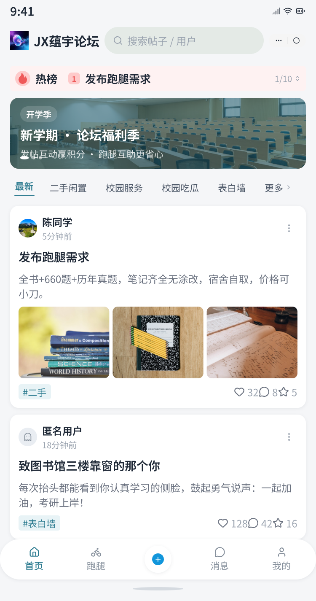 | 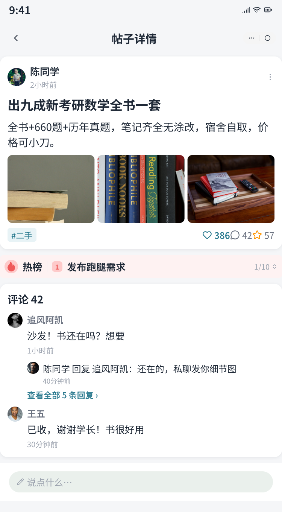 |
| 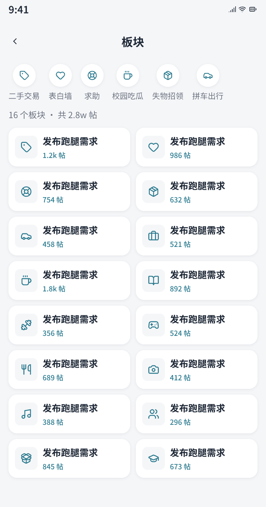 | 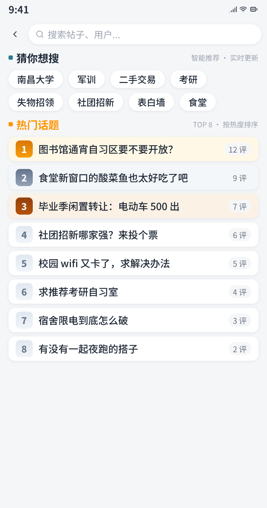 |
| 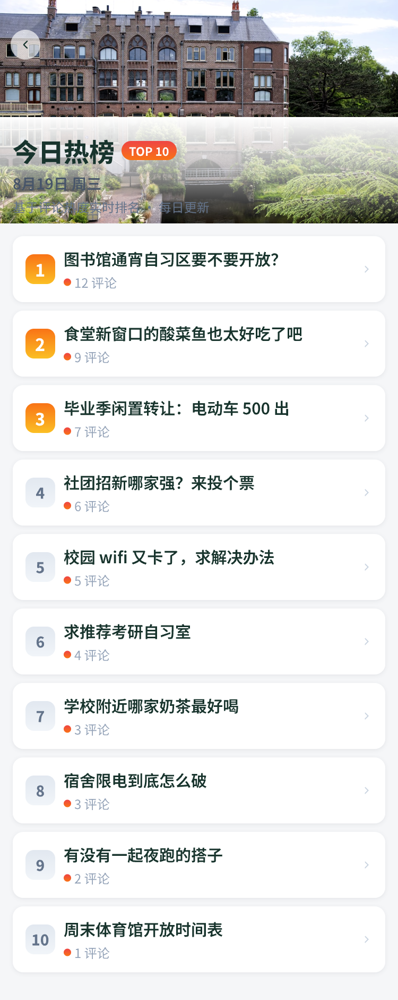 | 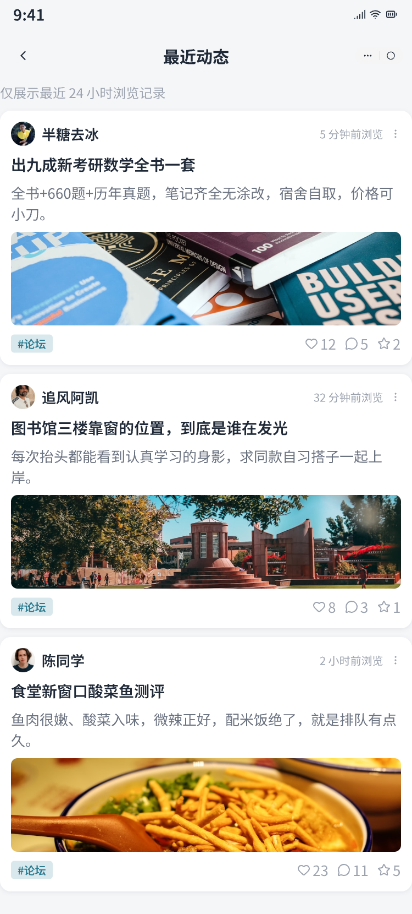 |
| 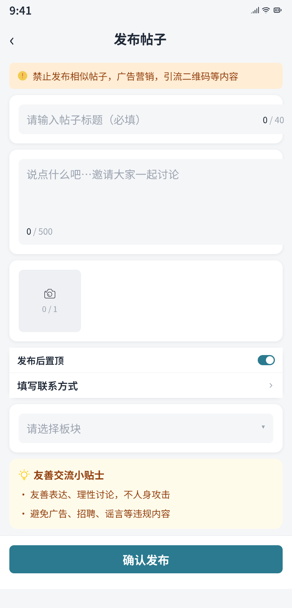 | 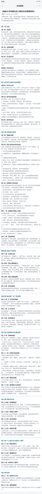 |

### 校园跑腿（C2C 撮合）

订单大厅、跑腿员工作台、发布跑腿订单等撮合场景。

| | |
| --- | --- |
| 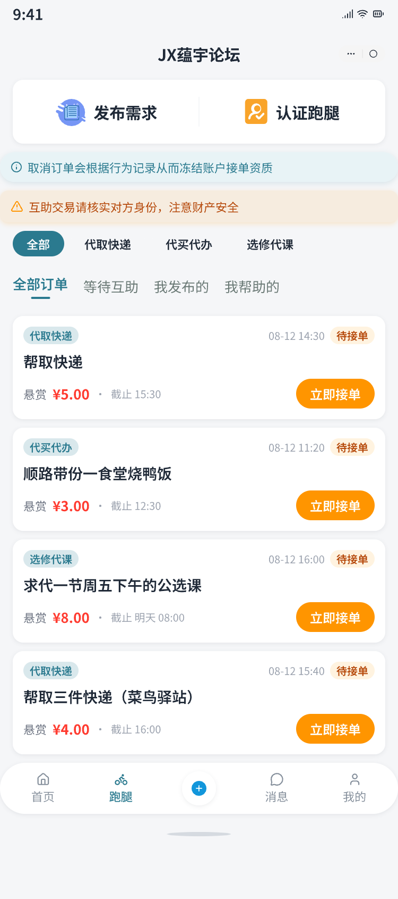 | 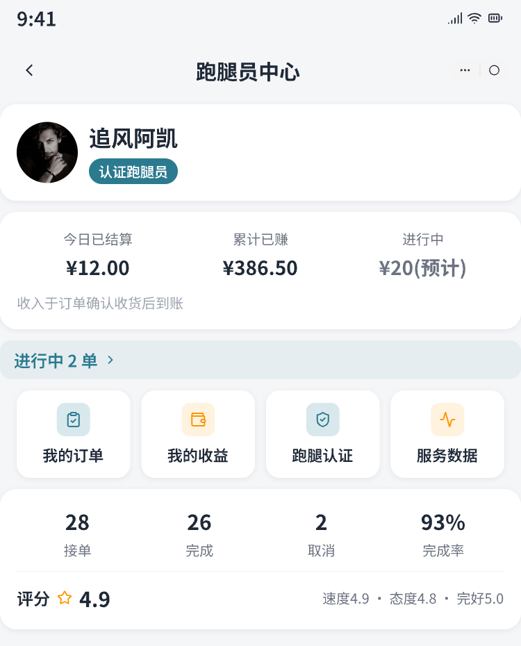 |
| 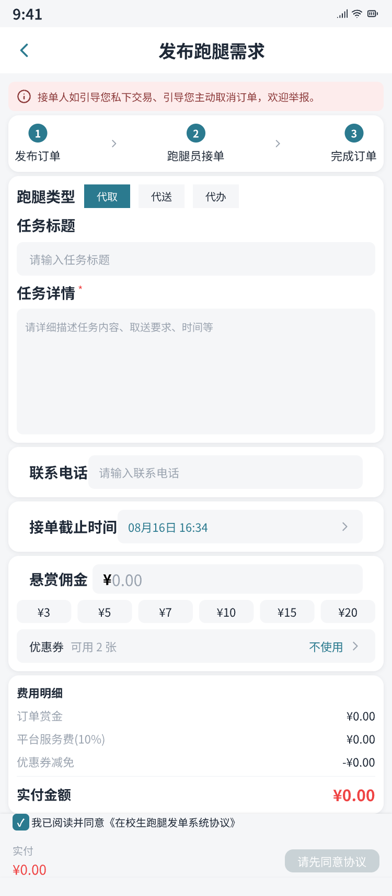 |  |

### 跑腿员认证

认证中心入口、校园认证、实名认证表单的入驻流程。

| | |
| --- | --- |
| 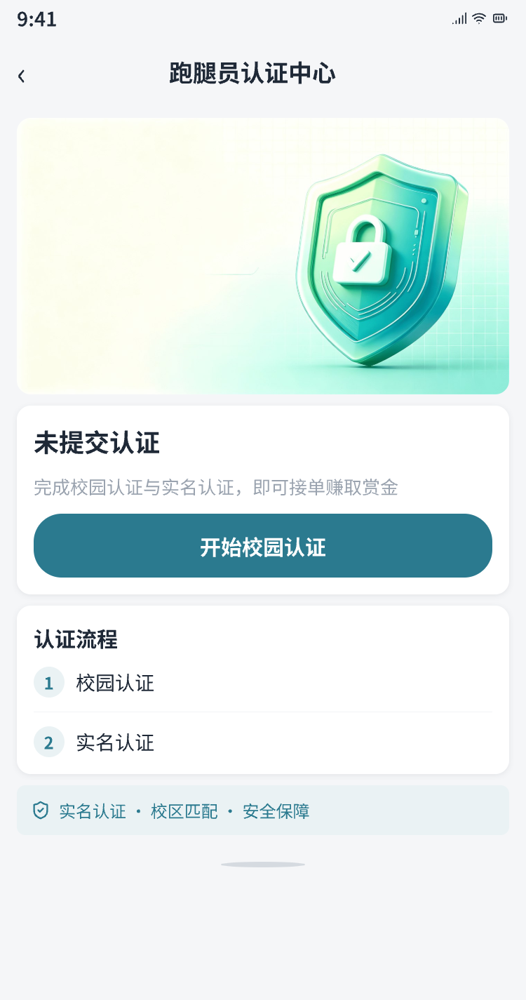 | 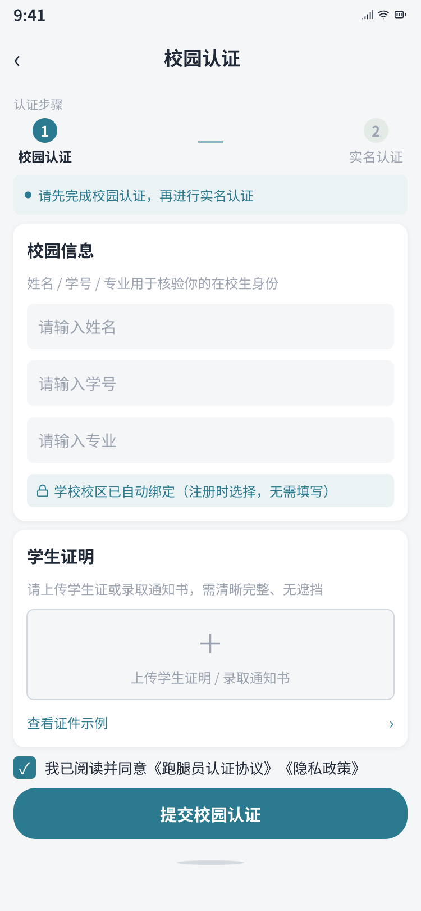 |
| 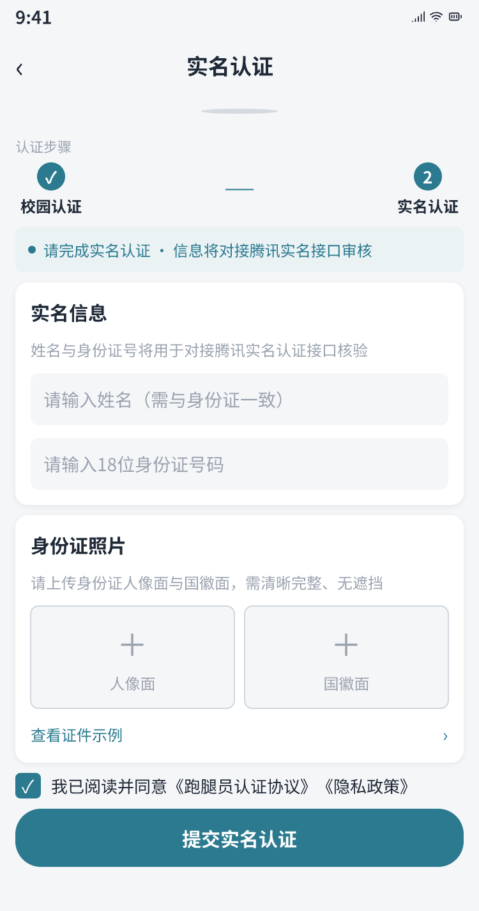 |  |

### 用户中心

我的页、个人中心、他人主页、消息通知等个人与社交场景。

| | |
| --- | --- |
| 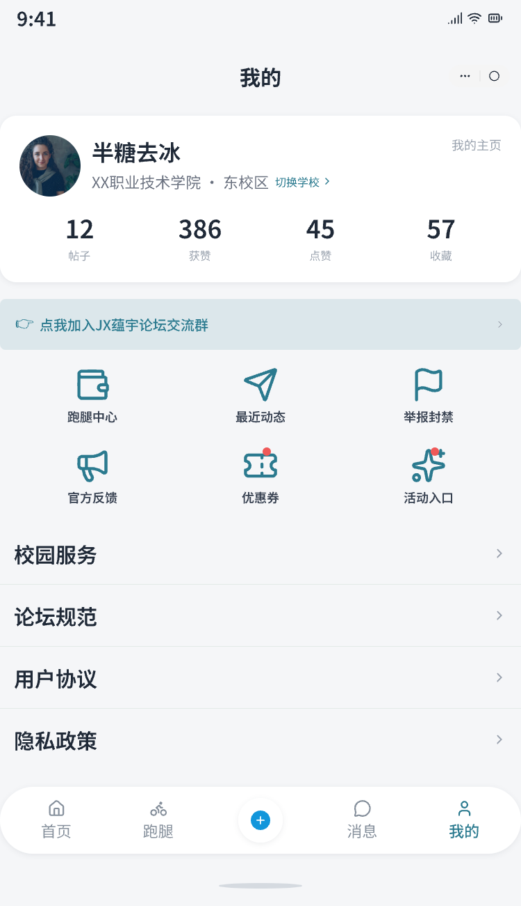 | 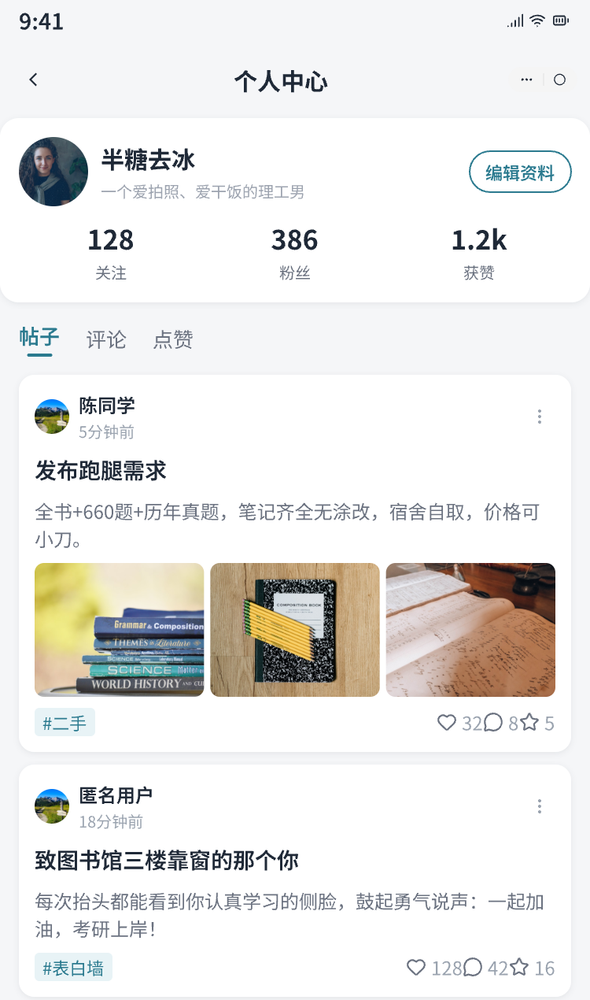 |
| 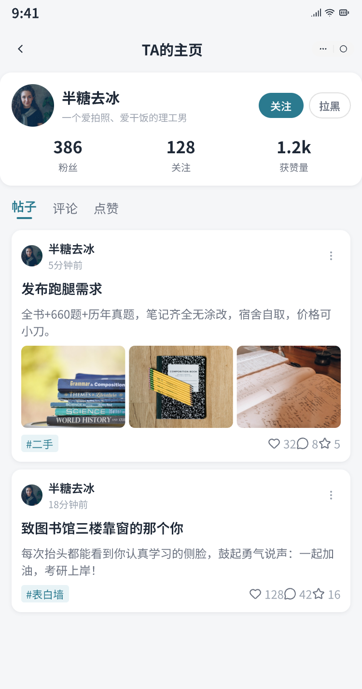 | 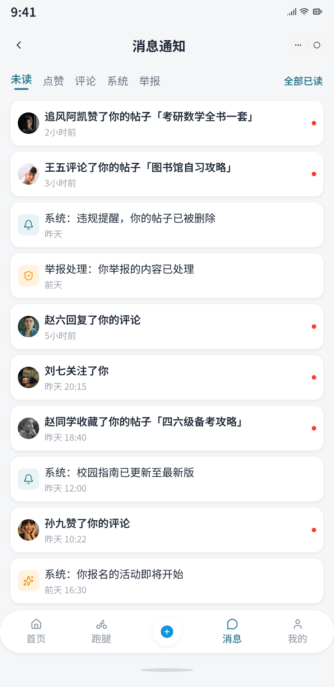 |

***

## 系统架构

```
微信小程序(uni-app) ──HTTPS──▶ Nginx (:80/:443，TLS 终结)
运营管理后台(Vue3)  ──HTTPS──▶ Nginx（托管 dist + 反代）
                                     │
                                     ▼
                    Spring Cloud Gateway (:8080，唯一对外入口)
                    路由转发 / JWT 校验 / Redis 限流 / CORS
              /wechatapi/*   ┌────┴────┐   /adminapi/*
                             ▼         ▼
                  core-service(:4501)   digital-service(:4502)
                  用户/学校/帖子/评论/    管理员RBAC/用户管理/内容审核
                  跑腿订单/支付/转账/     积分/优惠券/签到/活动/通知/
                  跑腿员认证/举报/上传    系统配置/企微推送/操作日志
                             ▼         ▼
       共享基础设施：MySQL 8.4（core/digital 双库）+ Redis 7 + 文件存储（本地/COS）
```

- **三进程轻量微服务**：gateway(:8080) + core(:4501) + digital(:4502)，合计约 3.2GB 内存，适配单台 4 核 4GB 服务器
- **数据边界**：core 主写 `YunYu_compus_core`（用户/帖子/跑腿/支付 20 余表），digital 主写 `YunYu_compus_digital`（管理员/积分/券/通知 20 余表）；**写入方唯一，跨进程只读共享库**
- **不引入 Nacos / Docker / MQ**：网关静态路由指向固定端口，事件链路用 Redis + 定时任务，单机部署更轻
- **生产安全**：业务服务仅监听 `127.0.0.1`，外部只可达网关；密钥全部走环境变量注入；Nginx 仅做 TLS 终结

***

## 技术栈

### 后端

| 分类   | 选型                                    | 版本       |
| ---- | ------------------------------------- | -------- |
| 语言   | Java                                  | 21 (LTS) |
| 框架   | Spring Boot                           | 3.5.16   |
| 网关   | Spring Cloud Gateway（WebFlux 响应式）     | 2025.0.3 |
| ORM  | MyBatis-Plus                          | 3.5.17   |
| 数据库  | MySQL（双库：core / digital）              | 8.4+     |
| 缓存   | Redis（缓存 / 分布式锁 / 限流）                 | 7.x      |
| 认证   | JWT（jjwt 0.12.7，三服务共享密钥）              | —        |
| 支付   | 微信支付 V3 官方 SDK（wechatpay-java 0.2.17） | —        |
| 实名   | 腾讯云慧眼 FaceID（身份证二要素）                  | 3.1.1435 |
| 接口文档 | springdoc-openapi + Swagger UI        | 2.8.17   |
| 工具   | Hutool / MapStruct / Lombok           | —        |

### 前端

| 端      | 选型                                                       |
| ------ | -------------------------------------------------------- |
| 用户端小程序 | uni-app（Vue 3 + Vite）+ SCSS 设计令牌（`$jx-*`）+ 自绘导航，零三方 UI 库 |
| 运营管理后台 | Vue 3 + Vite + Element Plus + Pinia + Vue Router         |

### 其他

| 分类     | 选型                                                                     |
| ------ | ---------------------------------------------------------------------- |
| 部署     | 裸 jar + systemd（Ubuntu/Debian，`deploy/scripts/install.sh` 一键部署）+ Nginx |
| 构建     | Maven（全量编译，关闭增量编译防 Lombok/MapStruct 漏生成）                               |

***

## 目录结构

```
JX蕴宇高校论坛系统/
├── jxfourm_uniopen/            # 用户端微信小程序（uni-app Vue3）
│   ├── pages/                  #  28 个业务页面（首页/跑腿/消息/我的/发布/举报/跑腿认证等）
│   ├── components/             #  自绘组件（tab-bar / post-card / hot-list / order-card 等）
│   ├── api/                    #  25 个领域 API 封装（对齐网关 /wechatapi/** 契约）
│   ├── stores/                 #  Pinia 状态（user / app）
│   ├── constants/              #  环境变量 / 业务码 / 事件
│   ├── utils/                  #  请求封装 / 登录守卫 / 彩色图标库 / 隐私工具
│   ├── static/                 #  静态资源与 iconfont 图标
│   └── scripts/                #  图标生成等开发脚本
│
├── yunyucompus/                # 后端微服务（Maven 多模块）
│   ├── gateway-service/        #  网关（:8080）路由/鉴权/限流/CORS
│   ├── core-service/           #  核心域（:4501）用户/帖子/评论/跑腿/支付/举报
│   ├── digital-service/        #  数字域（:4502）管理员/积分/券/签到/活动/通知/推送
│   ├── yunyu-common/           #  公共库（R 信封/异常/JWT/存储/安全）
│   └── deploy/                 #  部署：install.sh / nginx / systemd / .env.example / Windows 手册
│
├── art-design-proVue3AdminPC/  # 运营管理后台（Vue3 + Element Plus）
│
├── sql/                        # 建库建表脚本 + 种子数据 + 增量迁移（migration_0xx）
└── README.md / README_EN.md    # 本文件（中 / 英）
```

***

## 安装部署

> 完整部署手册见 `yunyucompus/deploy/`（含 [Windows 部署手册](yunyucompus/deploy/WINDOWS_DEPLOY.md)）。

### 环境要求

| 依赖        | 版本       | 说明                                                 |
| --------- | -------- | -------------------------------------------------- |
| JDK       | 21 (LTS) | 必需，项目要求 Java 21                                    |
| Maven     | 3.9+     | 离线仓库可用（`-o` 编译）                                    |
| MySQL     | 8.4+     | 需建两个库：`YunYu_compus_core` / `YunYu_compus_digital` |
| Redis     | 7.x      | 三服务共用                                              |
| Node.js   | 20.19+   | 仅管理后台构建需要                                          |
| HBuilderX | 最新       | 小程序前端编译（uni-app）                                   |
| 微信开发者工具   | 最新       | 小程序预览/上传                                           |

### 1. 初始化数据库

在 MySQL 中依次执行 `sql/` 目录脚本（建库建表 → 种子数据 → 增量迁移）：

```bash
mysql -u root -p < sql/01_schema_core.sql       # core 库表结构
mysql -u root -p < sql/01_schema_digital.sql    # digital 库表结构
mysql -u root -p < sql/02_seed_digital.sql      # 管理员/角色/系统配置种子数据
mysql -u root -p < sql/03_seed_core_boards.sql  # 板块种子数据
# 按需执行 sql/migration_0xx_*.sql 增量迁移
```

> 全量演示数据可导入 `sql/全量数据库/` 下的导出文件。

### 2. 构建后端

```bash
cd yunyucompus
mvn clean package -DskipTests
# 产物：gateway-service/target/*.jar、core-service/target/*.jar、digital-service/target/*.jar
```

### 3. 配置并启动后端（本地开发）

```bash
# 三服务各自需要：MySQL/Redis 连接、JWT 密钥（三服务同一密钥）
# 默认配置见各服务 application.yml（环境变量可覆盖，生产必须用环境变量注入密钥）
export JWT_SECRET=your-long-random-secret-at-least-32-chars
export MYSQL_CORE_PASSWORD=xxx
export MYSQL_DIGITAL_PASSWORD=xxx
export WX_APPID=你的小程序appid
export WX_SECRET=你的小程序secret      # 仅示例，切勿提交真实密钥

java -jar gateway-service/target/gateway-service.jar    # :8080
java -jar core-service/target/core-service.jar          # :4501
java -jar digital-service/target/digital-service.jar    # :4502
```

### 4. 启动小程序前端

1. 用 **HBuilderX** 打开 `jxfourm_uniopen/` 目录；
2. 配置 `manifest.json` 中 `mp-weixin.appid`（微信小程序 AppID）；
3. 若网关地址变更，修改 `constants/env.js` 的 `GATEWAY_BASE_URL`（或在运行时 `uni.setStorageSync('gateway_base_url', ...)` 覆盖）；
4. HBuilderX 运行到微信开发者工具（联调期需关闭 urlCheck）。

### 5. 启动运营管理后台

```bash
cd art-design-proVue3AdminPC
npm install
npm run dev        # 本地开发
npm run build      # 生产构建，产物 dist/ 由 Nginx 托管
```

### 6. 生产部署（Ubuntu/Debian）

```bash
cd yunyucompus
sudo ./deploy/scripts/install.sh   # 一键：编译 → 建用户/目录 → systemd + nginx → 启动
# 配置项：deploy/.env.example 复制为 /opt/yunyu-forum/.env 后填真实值
```

生产环境关键硬规（详见架构文档 §8.8）：

- core/digital 只监听 `127.0.0.1`，仅网关 8080 对外；
- 全部密钥（JWT / 数据库 / 微信 / 腾讯云）必须走环境变量注入，禁止留在 yml 提交；
- Nginx 仅做 TLS 终结与静态资源托管，`/wechatapi/**`、`/adminapi/**`、`/uploads/**` 反代到网关。

***

## 使用方法

### 用户端小程序（微信搜索/扫码进入）

1. **游客可浏览**：信息流刷帖、板块浏览、热榜、搜索无需登录；
2. **登录**：微信一键授权登录（游客优先，无 token 不强制登录）；
3. **发帖/评论**：选择板块发布图文帖子，可点赞/收藏/关注作者；
4. **发跑腿单**：发布代取/代送/代办订单并支付（微信支付 V3），跑腿员在订单大厅抢单履约，完成后双方互评；
5. **赚积分兑券**：每日签到得积分，积分兑换优惠券；
6. **举报**：对违规帖子/评论提交举报，实时跟踪处理进度。

### 运营管理后台

1. **登录**：使用 `02_seed_digital.sql` 种子的超级管理员账号登录（首次登录强制改密）；
2. **内容审核**：帖子/评论/举报管理，内容安全规则配置；
3. **跑腿运营**：跑腿员认证审核、订单/评价管理；
4. **增长运营**：积分规则、优惠券、签到、活动、通知/订阅模板、Banner、校区指南；
5. **系统管理**：管理员与角色权限（RBAC）、操作日志、系统配置。

### 接口文档（Swagger UI）

启动网关与业务服务后访问：

- core-service：`http://<host>:4501/swagger-ui.html`
- digital-service：`http://<host>:4502/swagger-ui.html`

***

## 许可证

本项目为**商业软件**，采用 [Business Source License 1.1](LICENSE)（BUSL-1.1）授权，蕴宇原创，版权所有 © 2026 JX蕴宇。

- **非生产性使用**（学习、研究、演示）免费许可：可复制、修改、分发、非生产使用；
- **生产、商业、对外运营及 SaaS 使用必须获得开发者书面商业授权**（本许可证 Additional Use Grant 为 None，不授予任何生产性使用权利）；
- **未取得商业授权的生产/商业/SaaS 使用即构成侵权（盗版），开发者有权依法追究责任**；
- 本许可证于 **2030-08-07（Change Date）** 起自动转换为 **GPL-2.0-or-later**，条款全文见 [LICENSE](LICENSE)。

***

## 联系方式

📞 **电话 / 微信：19870569575（微信同号）**

📧 **邮箱：<tearhacker@outlook.com>**

> 授权、合作、二次开发、源码定制请通过以上方式联系开发者。

